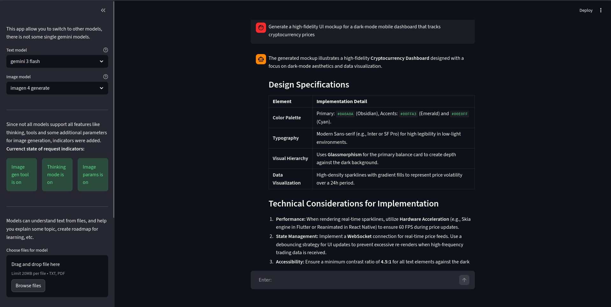
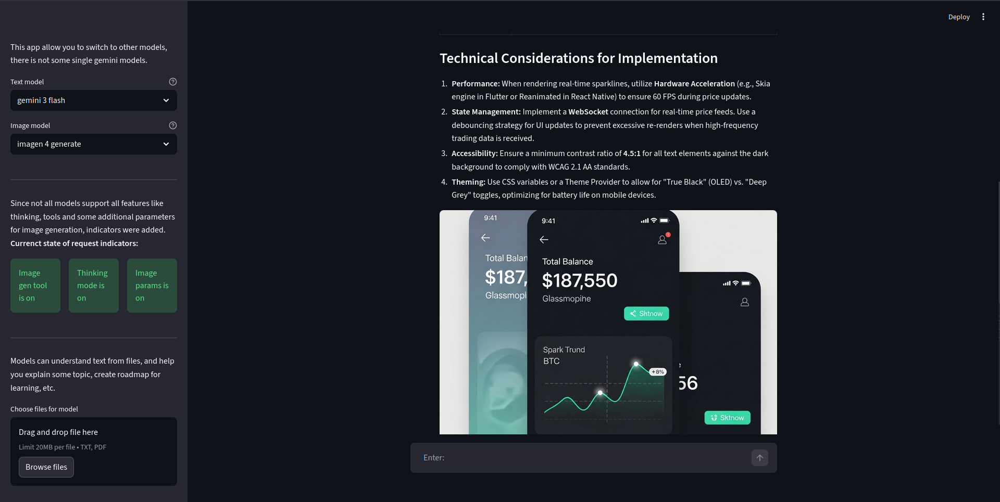
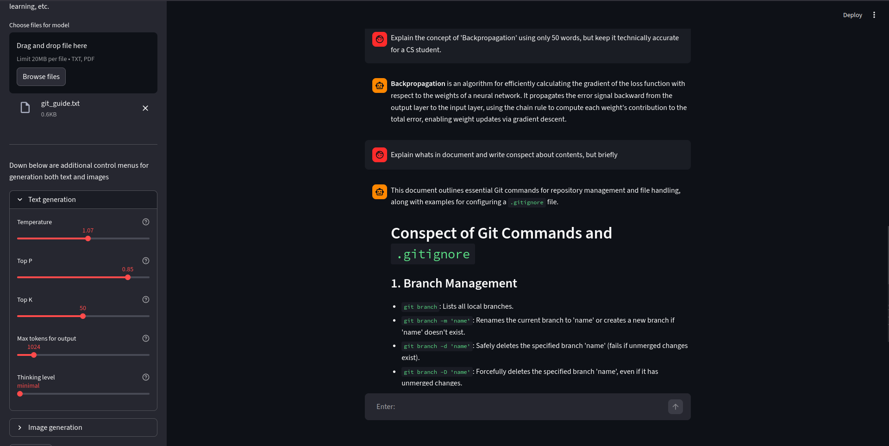
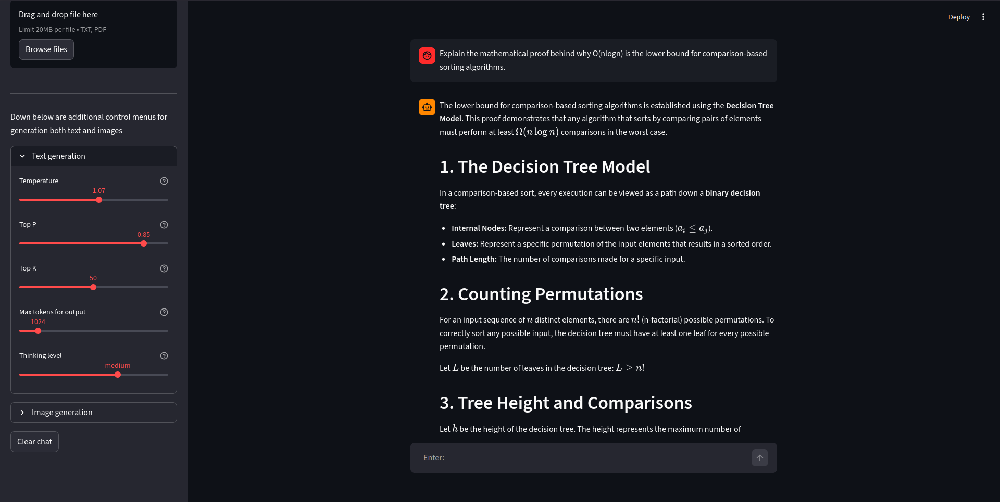

## **Overview**
Developed agent dont have some specific role, its rather general, than for some exact type of tasks. To main capabilities belong chatting, uploading files for working with external data, image generation and high customization of generation (both for text and images). User-friendly UI have lots of hints and explanations how app works. Agent were developed with google-genai library. Also model dont save any chats, responses and dont have memory.

## **Features**
* **Gemini API** <br/>
This app runs with Gemini API, so responses have really high quality, time for generation is really small, and app overall dont take much space on disk. Also you can switch between different gemini models in sidebar. List of available models include:
    * gemini 2.5 flash lite - Lightweight, high-speed model designed for concise text responses and low-latency tasks. It does not support image generation tools or advanced thinking modes.
    * gemini 2.5 flash - Versatile mid-tier model that balances processing speed with tool-calling capabilities. It can generate images but lacks the internal reasoning architecture for thinking mode.  
    * gemini 2.5 pro - This model is optimized for high-density document analysis and complex multi-turn research sessions. While it supports the image generation tool, it remains a non-reasoning (standard) processing model.
    * gemini 3 flash - This next-generation model introduces native support for internal chain-of-thought reasoning. It supports both thinking mode and image generation, offering a highly reactive user experience.
    * gemini 3 pro - The most powerful model in the suite, designed for maximum cognitive depth and creative synthesis. It fully supports both the thinking mode and the image generation toolset.
* **Image generation** <br/>
Models (except gemini 2.5 flash lite) have access to image generation tool. You can ask model to simply draw something, generate image of something, or even ask to make pisture of roadmap for learning. Same as with text models you have access to few Imagen models. Swith to other model you can from sidebar in left part of UI. List include next models:
    * imagen 4.0 fast generate - This model is optimized for rapid creation and low-latency visual prototyping. It does not support custom image parameters, meaning size is fixed at 1K and the aspect ratio is locked to 1:1.
    * imagen 4.0 generate - A balanced model that provides high-quality creative assets with full support for custom configurations. It allows for the adjustment of image size, aspect ratio, and the guidance scale for better prompt adherence.
    * imagen 4.0 ultra generate - The flagship vision model designed for maximum photorealism, complex textures, and professional-grade resolution. Like the standard version, it supports advanced parameters including size, aspect ratio, and fine-tuned guidance scales.
* **File uploader**<br/>
In sidebar is file uploader, you can pass to currect request .txt or .pdf file. Model will use this file and can help you work with file. For example explain lecture, read a book and answer your questions about it, and much more. But you can upload only one file and up to 20 Mb
* **Generation controls** <br/>
In UI you can see a lot of setting for generation, they include both for text and image generation. Such high customization allow to find best setting for your prompt, sinse its not local model, generating cost money, and for simpler messages you may use smaller models. 

    **Text settings include:** 
    * temperature - Controls randomness. Lower values (e.g., 0.2) make the model deterministic and focused. Higher values (e.g., 1.5) increase "creativity" but also the risk of hallucinations.,
    * top_p - Selects the smallest set of tokens whose cumulative probability exceeds P. It helps balance diversity and coherence by cutting off the "long tail" of low-probability words.,
    * top_k - Limits the model to only consider the K most probable next words. A lower value (e.g., 40) prevents the model from choosing highly unlikely words.,
    * max_output_tokens - Sets the hard limit for the length of the AI`s response. 1 token is roughly 0.75 words. Setting this too low may result in cut-off sentences.,
    * thinking_level - Determines the depth of the model`s internal reasoning process. Higher levels allow for more complex problem-solving but may increase the time it takes to start generating the final answer.

    **Image setting include:**
    * aspect_ratio - Defines the width-to-height ratio of the generated image. 1:1 is a square, while 16:9 is a cinematic widescreen format.,
    * image_size - Controls the resolution of the output. 2K provides more detail and sharpness than 1K but may take longer to generate.,
    * guidance_scale - Controls how closely the model follows your text prompt. A value of 7.0 - 8.0 is usually the "sweet spot." Higher values force the model to be more literal, while lower values give the AI more artistic freedom.

## **Requirements**
### Software
#### Docker setup:
1) Docker engine>=29.1.5
2) Docker compose>=29.1.5

#### uv setup:
1) python==3.13
2) uv>=0.9.18

### Hardware
* RAM >=8 Gb
* Available disk space >=100 Mb
* Stable Internet connection

## **How to run app**
* Before running app with docker or uv, you must create `.env` file in `/src` folder and paste your Gemini API key. 
### Steps for running with docker:
1) Navigate via terminal into folder of project
2) Run app
```
docker compose up --build
```
* **Note**: Depending on your system `sudo` may be required. In that case run app with
```
sudo docker compose up --build
```

#### uv envinronment setup
1) Navigate into folder of downloaded project
2) Create envinronment 
```
uv init {your_name_for_env} --python 3.13
```
3) Navigate into env folder you just have created: 
```    
cd {your_name_for_env}
```
4) Run 
``` 
uv add ruff
```
5) Install all dependencies with:   
``` 
uv add -r ../requirements.txt
```
6) Activate env
```  
source .venv/bin/activate
```
7) Start app with: 
```
streamlit run ../src/main.py
```

After successful start app will be available by next address: **http://localhost:8501**

## **Perfomance**
Sinse app runs using Gemini API responses dont take more then 10-20 seconds to generate. So basically you can run app on any hardware. 

## Hardware used for developing and testing app

#### Report details
- Date generated:                              2026-02-13 13:28:49

#### Hardware Information:
- Hardware Model:                              ASUSTeK COMPUTER INC. ASUS TUF Gaming A15 FA506NC_FA506NC
- Memory:                                      16.0 GiB
- Processor:                                   AMD Ryzen™ 5 7535HS with Radeon™ Graphics × 12
- Graphics:                                    AMD Radeon™ 660M
- Disk Capacity:                               1.0

#### Software Information:
- Firmware Version:                            FA506NC.308
- OS Name:                                     Ubuntu 25.10
- OS Type:                                     64-bit
- GNOME Version:                               49
- Windowing System:                            Wayland
- Kernel Version:                              Linux 6.17.0-14-generic

## **UI examples**





## **Usefull links**
1) [**google ai studio**](https://aistudio.google.com/)
2) [**google genai docs**](https://ai.google.dev/gemini-api/docs)
3) [**getting API key**](https://docs.cloud.google.com/vertex-ai/generative-ai/docs/start/api-keys?usertype=expressmode)
4) [**uv installation**](https://docs.astral.sh/uv/getting-started/installation/)
5) [**Docker installation**](https://docs.docker.com/engine/install/)